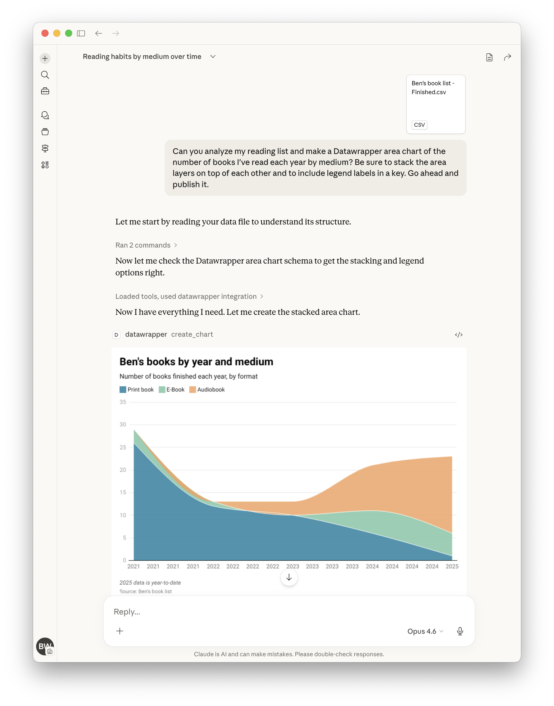

[](https://pypi.org/project/datawrapper-mcp/)
[](https://registry.modelcontextprotocol.io/?q=datawrapper)
[](https://hub.docker.com/r/palewire/datawrapper-mcp)

A Model Context Protocol (MCP) server and app for creating Datawrapper charts using AI assistants. Built on the [datawrapper Python library](https://github.com/chekos/datawrapper).

<!-- mcp-name: io.github.palewire/datawrapper-mcp -->

## Example Usage

You can provide a data file and simply ask for the chart you want. The draft will soon appear in the panel.



Here's a more complete example showing how to create, publish, update, and display a chart by chatting with the assistant:

```
"Create a datawrapper line chart showing temperature trends with this data:
2020, 15.5
2021, 16.0
2022, 16.5
2023, 17.0"
# The assistant creates the chart and returns the chart ID, e.g., "abc123"

"Publish it."
# The assistant publishes it and returns the public URL

"Update chart with new data for 2024: 17.2°C"
# The assistant updates the chart with the new data point

"Make the line color dodger blue."
# The assistant updates the chart configuration to set the line color

"Show me the editor URL."
# The assistant returns the Datawrapper editor URL where you can view/edit the chart

"Show me the PNG."
# The assistant embeds the PNG image of the chart in its contained response.

"Suggest five ways to improve the chart."
# See what happens!
```

## Tools

| Tool               | Description                                        |
| ------------------ | -------------------------------------------------- |
| `list_chart_types` | List available chart types with descriptions       |
| `get_chart_schema` | Get the full configuration schema for a chart type |
| `create_chart`     | Create a new chart with data and configuration     |
| `update_chart`     | Update an existing chart's data or styling         |
| `publish_chart`    | Publish a chart to make it publicly accessible     |
| `get_chart`        | Retrieve a chart's configuration and metadata      |
| `delete_chart`     | Permanently delete a chart                         |
| `export_chart_png` | Export a chart as a PNG image                      |

## Chart Types

bar, line, area, arrow, column, multiple column, scatter, stacked bar

Use `list_chart_types` to see descriptions, then `get_chart_schema` to explore configuration options for any type.

## Getting Started

### Requirements

- A Datawrapper account (sign up at https://datawrapper.de/signup/)
- An MCP client such as [Claude](https://claude.ai/) or [OpenAI Codex](https://openai.com/codex/)
- Python 3.10 or higher

### Get Your API Token

1. Go to https://app.datawrapper.de/account/api-tokens
2. Create a new API token
3. Add it to your MCP configuration as shown in the [installation guide](INSTALLATION.md)

### Quick Start (Claude Code)

```json
{
  "mcpServers": {
    "datawrapper": {
      "command": "uvx",
      "args": ["datawrapper-mcp"],
      "env": {
        "DATAWRAPPER_ACCESS_TOKEN": "your-token-here"
      }
    }
  }
}
```

For other clients (Claude Desktop, Cursor, VS Code Copilot, ChatGPT, OpenAI Codex) and Kubernetes deployment, see the [installation guide](INSTALLATION.md).

### Supported Clients

| Client          | Config file                  | Transport                |
| --------------- | ---------------------------- | ------------------------ |
| Claude Desktop  | `claude_desktop_config.json` | stdio or streamable-http |
| Claude.ai       | Managed connector            | streamable-http          |
| Claude Code     | `.claude/settings.json`      | stdio                    |
| VS Code Copilot | `.vscode/mcp.json`           | stdio                    |
| Cursor          | `.cursor/mcp.json`           | stdio or streamable-http |
| ChatGPT         | Dev Mode settings            | streamable-http only     |
| OpenAI Codex    | `~/.codex/config.toml`       | stdio                    |
